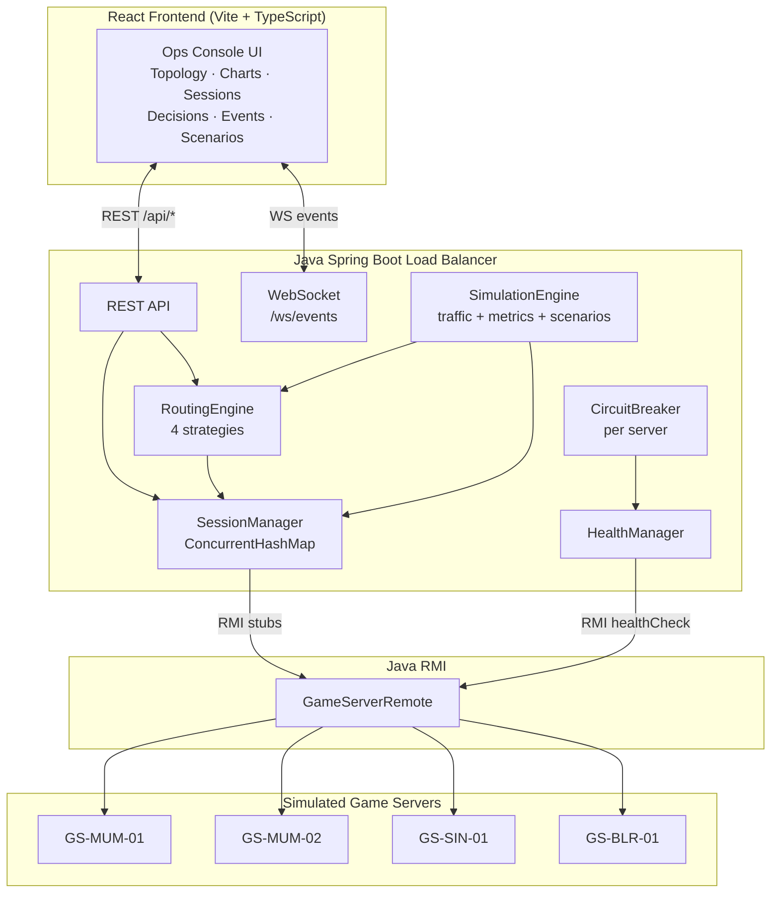

# GameFlow LB — Interactive Cloud Gaming Load Balancer Simulator

**GameFlow LB** is an interactive simulator that shows, in real time, how a
cloud-gaming load balancer thinks: player requests arrive, a routing engine
scores candidate game servers on latency, GPU/CPU load, packet loss and more,
sessions are established over Java RMI, health checks run continuously, circuit
breakers trip on failure, and traffic is rerouted and migrated — all visible in
a live operations console.

It is built as a **real distributed system**, not a mockup: every number on
screen originates in the Java simulation; the React frontend only renders what
the backend streams over WebSocket.

---

## Problem being solved

Cloud gaming is uniquely latency-sensitive: a 150 ms round trip that is fine
for video streaming ruins a competitive shooter. A cloud-gaming load balancer
must therefore route each player session using **multiple live signals** —
latency, GPU/CPU utilization, packet loss, jitter, active sessions — while
surviving server failures without dropping players.

GameFlow LB demonstrates exactly that decision loop, made explainable: every
routing decision records *why* a server was picked and *why* the others were
rejected.

## Architecture



Request lifecycle:

```mermaid
sequenceDiagram
    participant P as Player request
    participant LB as Load Balancer
    participant RE as RoutingEngine
    participant RMI as GameServerRemote (RMI)
    participant GS as Game Server

    P->>LB: PlayerRequest (region, game, 1080p/60)
    LB->>RMI: getMetrics() × N servers
    RMI-->>LB: ServerMetrics
    LB->>RE: score candidates
    RE-->>LB: RoutingDecision (scores + reasons)
    LB->>RMI: createSession(request)
    RMI->>GS: allocate session
    GS-->>LB: GameSession
    LB-->>P: session established (WS: ROUTING_DECISION, SESSION_CREATED)
```

### Why Java RMI?

RMI is the honest boundary in this architecture: the load balancer never
touches a game server's objects directly. Every metric pull, health check and
session create/terminate goes through an RMI stub obtained via
`Naming.lookup`. That makes failure modes real instead of simulated:

- **RMI_FAILURE** — the server's methods throw `RemoteException`; health
  checks fail; the circuit opens; traffic reroutes.
- **CRASH** — the remote object is unexported and unbound; stubs go stale;
  sessions migrate to survivors.
- **Recovery** — the server is re-exported and rebound; health probes pass;
  the circuit half-opens, then closes; traffic gradually returns.

The registry, stubs and failure semantics are genuine RMI — co-located in one
JVM only so the demo runs with a single command.

> **RMI unavailable?** If the RMI registry cannot bind (e.g. a sandboxed
> network that blocks JRMP traffic), the backend logs a warning and falls
> back to direct in-JVM handles through the same `GameServerRemote`
> interface. Servers report `rmiStatus: UNREACHABLE`, but routing, health
> checks, circuit breakers, sessions and scenarios all keep working.

### Routing algorithm

Default strategy `WEIGHTED_GAMING` (lower is better, 0–100):

```
score = norm(latency)     × 0.35
      + norm(cpu)         × 0.20
      + norm(gpu)         × 0.20
      + norm(packetLoss)  × 0.10
      + norm(sessions)    × 0.10
      + norm(jitter)      × 0.05
```

Normalization caps: latency/100 ms, cpu/100, gpu/100, packetLoss/5%,
sessions/capacity, jitter/20 ms. Latency dominates because cloud gaming is
latency-sensitive. Hard exclusion (with recorded reason): GPU > 90%, packet
loss > 5%, player latency > 100 ms, circuit OPEN, server
UNHEALTHY/OFFLINE/RECOVERING. Alternatives: `LEAST_SESSIONS`,
`LOWEST_LATENCY`, `ROUND_ROBIN` — switchable live from the UI.

### Session management

`SessionManager` keeps sessions in a `ConcurrentHashMap`. States:
`CREATING → ACTIVE → (MIGRATING) → TERMINATING → TERMINATED`, plus `FAILED`.
On server failure, affected sessions are marked `MIGRATING`, re-routed through
the routing engine, and reassigned — the UI animates the migration.

### Circuit breaker

Per server: `CLOSED` → 3 consecutive failures → `OPEN` (removed from routing)
→ 10 s → `HALF_OPEN` (single probe) → success `CLOSED`, failure `OPEN`.

## Technology stack

| Layer | Tech |
|---|---|
| Backend | Java 21, Spring Boot 3.2 (WebFlux), Java RMI, Maven, JUnit 5, Mockito |
| Frontend | React 18, TypeScript, Vite, Tailwind CSS, React Flow, Recharts, Framer Motion, lucide-react |
| Streaming | WebSocket (`/ws/events`), REST (`/api/*`) |
| Containers | Podman / Docker-compatible Containerfiles, Podman Compose |

## Demo scenarios

Available on the Demo Scenarios page (all scripted, deterministic):

- **Normal Traffic** — players arrive gradually; balanced routing
- **GPU Saturation** — GS-MUM-02 GPU ramps 70% → 97%; routing sheds load
- **Latency Spike** — one server 20 ms → 180 ms; traffic moves away
- **Packet Loss** — 0.1% → 12%; server becomes unsuitable
- **Server Failure** — RMI crash; health checks fail; circuit opens; sessions migrate
- **Server Recovery** — OFFLINE → RECOVERING → HALF_OPEN → HEALTHY → CLOSED; traffic returns
- **Traffic Surge** — 20 → 200 sessions; utilization climbs

Manual fault injection per server is also available: GPU overload, latency
spike, packet loss, RMI failure, crash, recover.

## How to run locally

Prerequisites: Java 21+, Maven, Node 20+.

```bash
# Backend (http://localhost:8080, RMI registry :1099)
cd backend
mvn spring-boot:run

# Frontend (http://localhost:5173)
cd frontend
npm install
npm run dev
```

Open http://localhost:5173 and press **Start Simulation**.

### Run with Podman

```bash
podman compose up --build
# Frontend: http://localhost:3000  (proxies /api and /ws to the backend)
# Backend:  http://localhost:8080
```

`docker compose` works identically — the Containerfiles are Docker-compatible.

## API overview

Full contract: [`CONTRACT.md`](CONTRACT.md).

| Method | Path | Purpose |
|---|---|---|
| GET | `/api/system` | Status, sim state, speed, fleet totals |
| GET | `/api/servers` / `/api/servers/{id}` | Servers + live metrics |
| GET | `/api/sessions` | Sessions (`?state=&serverId=&search=`) |
| GET | `/api/routing/decisions?limit=` | Inspectable routing decisions |
| GET/PUT | `/api/routing/strategy` | Active routing strategy |
| GET | `/api/events?limit=&severity=` | Ops event log |
| POST | `/api/simulation/start\|pause\|resume\|reset` | Simulation control |
| PUT | `/api/simulation/speed` | 0.5 / 1 / 2 / 5 |
| POST | `/api/scenarios/{id}/start\|stop` | Demo scenarios |
| POST | `/api/servers/{id}/fault` | Inject fault (`{type}`) |
| POST | `/api/servers/{id}/recover` | Recover server |
| GET | `/api/metrics/history?windowSec=` | Chart history seed |

WebSocket `ws://localhost:8080/ws/events` streams: `METRIC_UPDATE`,
`SERVER_STATE_CHANGED`, `SESSION_CREATED/TERMINATED/MIGRATING/MIGRATED`,
`ROUTING_DECISION` (full, with per-candidate score breakdown),
`CIRCUIT_CHANGED`, `SYSTEM_EVENT`, `SIMULATION_STATE_CHANGED`.

## Screenshots

> Screenshots are not bundled with this repo — run the stack locally
> (`podman compose up --build`, then open http://localhost:3000) to see the
> live console: overview dashboard, topology with routing animation, routing
> decision inspector, failover (server failure → circuit open → migration),
> and metrics charts.

## Tests

```bash
cd backend
mvn test
```

Covers: weighted-score math, all exclusion rules, latency dominance,
GPU/packet-loss penalties, circuit-breaker transitions (incl. half-open probe
success/failure), session creation, failover reassignment, health-state
transitions, and RMI failure → OFFLINE via a Mockito-thrown
`RemoteException`.

## Project layout

```
gameflow-lb/
├── backend/                 # Spring Boot load balancer + RMI game servers
│   └── src/main/java/com/gameflow/
│       ├── api/             # REST controllers
│       ├── websocket/       # WS event broadcaster
│       ├── routing/         # RoutingEngine + 4 strategies
│       ├── rmi/             # GameServerRemote, impls, registry
│       ├── session/         # SessionManager
│       ├── health/          # HealthManager, CircuitBreaker
│       ├── simulation/      # SimulationEngine, traffic, metrics, scenarios
│       ├── events/          # EventBus
│       └── history/         # Metric history ring buffers
├── frontend/                # React ops console
│   └── src/
│       ├── pages/           # 10 routes
│       ├── components/      # Topology, drawer, inspector, charts…
│       └── state/           # WS-driven global store
├── CONTRACT.md              # API + WebSocket contract (both sides conform)
├── Containerfile.backend / Containerfile.frontend
└── compose.yaml
```

## Future improvements

- Run each game server as a separate JVM/process (or container) with the RMI
  registry shared over the network — the code is already structured for it.
- True live migration of encoder state instead of session reassignment.
- Persistent event/decision store (e.g. TimescaleDB) for post-mortems.
- Latency-aware client georouting with real GeoIP instead of the sim matrix.
- Chaos scenarios: network partitions, rolling deploys, noisy-neighbor
  contention on shared GPU hosts.
