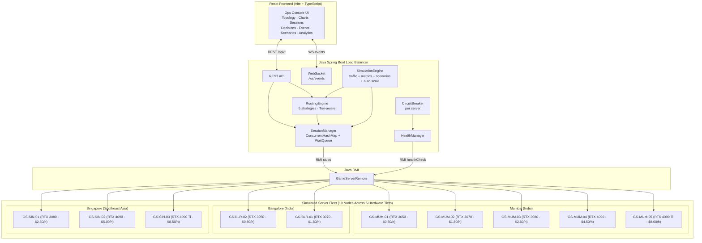
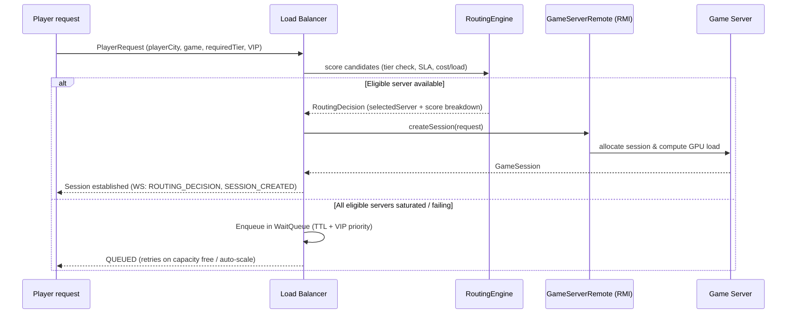

# GameFlow LB — Interactive Cloud Gaming Load Balancer Simulator

**GameFlow LB** is an interactive simulator that shows, in real time, how a
cloud-gaming load balancer thinks: player requests arrive, a routing engine
scores candidate game servers on latency, GPU/CPU load, packet loss and more,
sessions are established over Java RMI, health checks run continuously, circuit
breakers trip on failure, and traffic is rerouted and migrated — all visible in
a live operations console.

It is built as a **real distributed system**, not a mockup: every number on
screen originates in the Java simulation; the React frontend only renders what
the backend streams over WebSocket.

---

## Problem being solved

Cloud gaming is uniquely latency-sensitive: a 150 ms round trip that is fine
for video streaming ruins a competitive shooter. A cloud-gaming load balancer
must therefore route each player session using **multiple live signals** —
latency, GPU/CPU utilization, packet loss, jitter, active sessions — while
surviving server failures without dropping players.

GameFlow LB demonstrates exactly that decision loop, made explainable: every
routing decision records *why* a server was picked and *why* the others were
rejected.

## Architecture



Request lifecycle:



### Why Java RMI?

RMI is the honest boundary in this architecture: the load balancer never
touches a game server's objects directly. Every metric pull, health check and
session create/terminate goes through an RMI stub obtained via
`Naming.lookup`. That makes failure modes real instead of simulated:

- **RMI_FAILURE** — the server's methods throw `RemoteException`; health
  checks fail; the circuit opens; traffic reroutes.
- **CRASH** — the remote object is unexported and unbound; stubs go stale;
  sessions migrate to survivors.
- **Recovery** — the server is re-exported and rebound; health probes pass;
  the circuit half-opens, then closes; traffic gradually returns.

The registry, stubs and failure semantics are genuine RMI — co-located in one
JVM only so the demo runs with a single command.

> **RMI unavailable?** If the RMI registry cannot bind (e.g. a sandboxed
> network that blocks JRMP traffic), the backend logs a warning and falls
> back to direct in-JVM handles through the same `GameServerRemote`
> interface. Servers report `rmiStatus: UNREACHABLE`, but routing, health
> checks, circuit breakers, sessions and scenarios all keep working.

---

## Routing Engine & Hardware Tier Hierarchy

The load balancer features 5 switchable routing strategies:

1. **`WEIGHTED_GAMING` (Default)**: Multivariable composite score (lower is better, 0–100):
   ```
   score = norm(latency)     × 0.35
         + norm(cpu)         × 0.20
         + norm(gpu)         × 0.20
         + norm(packetLoss)  × 0.10
         + norm(sessions)    × 0.10
         + norm(jitter)      × 0.05
   ```
   *Normalization caps:* latency/100 ms, cpu/100, gpu/100, packetLoss/5%, sessions/capacity, jitter/20 ms.
2. **`COST_OPTIMIZED`**: Evaluates server hourly cost with latency SLA guarantees:
   - Filters out ineligible servers and nodes failing the game's minimum hardware tier.
   - Enforces soft SLA: servers with player latency $< 60\text{ ms}$ are scored primarily by hourly rate: $\text{score} = \text{costPerHour} + (\text{latency} / 1000)$.
   - Servers exceeding 60 ms incur a $+15.0$ SLA penalty, favoring local cost-effective nodes while allowing regional overflow.
3. **`LEAST_SESSIONS`**: Directs players to servers with the lowest active session count.
4. **`LOWEST_LATENCY`**: Directs players strictly to the geographically nearest server with lowest network RTT.
5. **`ROUND_ROBIN`**: Cycles uniformly across eligible healthy nodes.

### Hardware Tier Hierarchy & Compatibility

Cloud gaming workloads have strict GPU compute and VRAM constraints. GameFlow LB enforces a multi-tier downward-compatible GPU hierarchy:

$$\text{RTX\_3050 (Rank 1)} < \text{RTX\_3070 (Rank 2)} < \text{RTX\_3080 (Rank 3)} < \text{RTX\_4090 (Rank 4)} < \text{RTX\_4090\_TI (Rank 5)}$$

- **Downward Compatibility**: A server can host any game whose requirement is **less than or equal to** the server's tier (e.g., an `RTX_4090` node can run `MINECRAFT` or `VALORANT` if capacity allows).
- **Hard Tier Exclusion**: A server below the game's tier (e.g., `RTX_3050` trying to run `CYBERPUNK_2077` or `GTA 6`) is rejected immediately with penalty reason `TIER_MISMATCH`.
- **Other Hard Exclusions**: GPU $> 90\%$, packet loss $> 5\%$, player latency $> 100\text{ ms}$, circuit `OPEN`, or server `UNHEALTHY`/`OFFLINE`/`RECOVERING`.

---

## Real Game Catalog (13 Titles)

Games realistically model memory footprint, streaming bandwidth, CPU logic, and ray-tracing/GPU requirements:

| ID | Title | Genre | Min GPU Tier | GPU Load | VRAM Load | Network Load | CPU Load | Latency Sensitive |
|---|---|---|:---:|:---:|:---:|:---:|:---:|:---:|
| `MINECRAFT` | Minecraft | Sandbox | `RTX_3050` | 22% | 18% | 35% | 40% | No |
| `ROCKET_LEAGUE` | Rocket League | Sports Arena | `RTX_3050` | 30% | 25% | 80% | 45% | **Yes** |
| `VALORANT` | Valorant | Competitive Shooter | `RTX_3070` | 42% | 38% | 90% | 50% | **Yes** |
| `APEX_LEGENDS` | Apex Legends | Battle Royale | `RTX_3070` | 58% | 52% | 82% | 60% | **Yes** |
| `FORTNITE` | Fortnite | Battle Royale | `RTX_3070` | 52% | 47% | 78% | 55% | **Yes** |
| `FORZA_HORIZON_5`| Forza Horizon 5 | Racing Sim | `RTX_3080` | 72% | 65% | 60% | 58% | **Yes** |
| `GOD_OF_WAR` | God of War | Action Adventure | `RTX_3080` | 78% | 72% | 42% | 68% | No |
| `RED_DEAD_2` | Red Dead Redemption 2 | Open World | `RTX_3080` | 82% | 78% | 48% | 72% | No |
| `WITCHER_3` | Witcher 3 | Action RPG | `RTX_3080` | 75% | 70% | 45% | 65% | No |
| `CYBERPUNK_2077` | Cyberpunk 2077 | Open-World RPG | `RTX_4090` | 92% | 88% | 55% | 72% | No |
| `ALAN_WAKE_2` | Alan Wake 2 | Survival Horror | `RTX_4090` | 94% | 90% | 40% | 70% | No |
| `GTA_VI` | GTA 6 | Open World Action | `RTX_4090_TI` | 97% | 95% | 65% | 80% | No |
| `STAR_CITIZEN` | Star Citizen | Space Sim MMO | `RTX_4090_TI` | 98% | 97% | 70% | 85% | No |

---

## Game Server Fleet (10 Nodes)

| Server ID | Location | Region | GPU Tier | Capacity | Hourly Rate |
|---|---|---|:---:|:---:|:---:|
| `GS-MUM-01` | Mumbai | India | `RTX_3050` | 100 | $0.80 / hr |
| `GS-BLR-02` | Bangalore | India | `RTX_3050` | 100 | $0.80 / hr |
| `GS-MUM-02` | Mumbai | India | `RTX_3070` | 80 | $1.80 / hr |
| `GS-BLR-01` | Bangalore | India | `RTX_3070` | 80 | $1.80 / hr |
| `GS-MUM-03` | Mumbai | India | `RTX_3080` | 60 | $2.50 / hr |
| `GS-SIN-01` | Singapore | Southeast Asia | `RTX_3080` | 60 | $2.80 / hr |
| `GS-MUM-04` | Mumbai | India | `RTX_4090` | 60 | $4.50 / hr |
| `GS-SIN-02` | Singapore | Southeast Asia | `RTX_4090` | 60 | $5.00 / hr |
| `GS-MUM-05` | Mumbai | India | `RTX_4090_TI`| 40 | $8.00 / hr |
| `GS-SIN-03` | Singapore | Southeast Asia | `RTX_4090_TI`| 40 | $8.50 / hr |

---

### Session Management, Failover & Wait Queues

- **State Lifecycle**: `CREATING → ACTIVE → (MIGRATING) → TERMINATING → TERMINATED`, plus `FAILED` and `QUEUED`.
- **Dynamic Failover**: On server crash or circuit trip, impacted sessions switch to `MIGRATING` and reroute across healthy nodes in real time.
- **Priority Wait Queue**: When all eligible nodes reach saturation, requests enter a bounded wait queue with TTL expiration, retry backoff, and VIP priority overrides.
- **Auto-Scaler & Fleet Burn Rate**:
  - Automatically spins up new nodes in round-robin GPU tiers (`RTX_3050` through `RTX_4090_TI`) during high-traffic surges.
  - Automatically scales down idle dynamic instances during low load.
  - Real-time **Fleet Burn Rate ($/hr)** calculated and displayed across the UI and telemetry streams.

### Circuit Breaker

Per server: `CLOSED` → 3 consecutive failures → `OPEN` (removed from routing)
→ 10 s → `HALF_OPEN` (single probe) → success `CLOSED`, failure `OPEN`.

---

## Core Features & Functionality

- **Live Topology Graph**: Interactive React Flow graph displaying nodes, animated packet flow, real-time circuit-breaker statuses, and animated route flash highlights.
- **Visual Playground & ChaosBar**: Real-time traffic dial (adjust RPS / session count on the fly), transport selector, and instant chaos injection (GPU overload, latency spikes, packet loss, RMI failure, crash, recover).
- **Packet Flow Animation**: Canvas-rendered live particle animation showing packets traveling from client regions through the load balancer to the selected game servers.
- **Routing Decision Inspector**: Deep inspection of candidate scoring breakdowns, penalty reasons, and algorithm weights across all 5 strategies (`WEIGHTED_GAMING`, `COST_OPTIMIZED`, `LEAST_SESSIONS`, `LOWEST_LATENCY`, `ROUND_ROBIN`).
- **Hardware Tier Compatibility**: Real-time hardware requirement matching and tier hierarchy filtering (`RTX_3050` through `RTX_4090_TI`).
- **Fleet Burn Rate & Analytics**: Live telemetry tracking active sessions, requests/sec, average latency, GPU utilization, packet loss, and fleet operational burn rate ($/hr).
- **Deterministic & Custom Scenarios**: Run built-in stress scenarios or use the **Custom Scenario Builder** to compose multi-step chaos drills.

---

## Technology stack

| Layer | Tech |
|---|---|
| Backend | Java 21, Spring Boot 3.2 (WebFlux), Java RMI, Maven, JUnit 5, Mockito |
| Frontend | React 18, TypeScript, Vite, Tailwind CSS, React Flow, Recharts, Framer Motion, lucide-react |
| Streaming | WebSocket (`/ws/events`), REST (`/api/*`) |
| Deployment | Local-only, zero container/cloud dependencies |

---

## Demo scenarios

Available on the Demo Scenarios page (all scripted, deterministic):

- **Normal Traffic** — players arrive gradually; balanced routing
- **GPU Saturation** — GS-MUM-02 GPU ramps 70% → 97%; routing sheds load
- **Latency Spike** — one server 20 ms → 180 ms; traffic moves away
- **Packet Loss** — 0.1% → 12%; server becomes unsuitable
- **Server Failure** — RMI crash; health checks fail; circuit opens; sessions migrate
- **Server Recovery** — OFFLINE → RECOVERING → HALF_OPEN → HEALTHY → CLOSED; traffic returns
- **Traffic Surge** — 20 → 200 sessions; utilization climbs

Manual fault injection per server is also available: GPU overload, latency
spike, packet loss, RMI failure, crash, recover.

### Custom scenarios

The Scenarios page also has a **custom scenario builder**: compose your own
timeline from ordered steps and run it like any demo scenario.

Step types: `WAIT` (seconds) · `SET_TRAFFIC` (target sessions) ·
`FAULT` (server + fault type) · `RECOVER` (server) · `STRATEGY` (routing
strategy). Steps run in order on a wall-clock timeline — each step's action
fires on entry, action steps dwell 3s so their effects are visible, `WAIT`
steps pace the timeline, and the scenario stops itself (event
`SCENARIO_COMPLETED`) after the last step. Custom scenarios are listed with a
`CUSTOM` badge and can be deleted; stopping one clears the faults it injected.

Example — failover drill: `SET_TRAFFIC 120` → `WAIT 10s` →
`FAULT CRASH on GS-MUM-02` → `WAIT 30s` → `RECOVER GS-MUM-02` →
`STRATEGY LEAST_SESSIONS`.

---

## How to run the application

Prerequisites: **Java 21+** and **Node.js 18+ (with npm)**.

### Option 1: Windows One-Click (`start.bat`) — Recommended for Windows

Double-click `start.bat` in File Explorer, or run it from Command Prompt / PowerShell:

```cmd
start.bat
```

What `start.bat` does automatically:
1. **Finds Java 21+**: Checks `PATH`, `JAVA_HOME`, and common JDK install locations (such as Eclipse Adoptium, Oracle, and Microsoft OpenJDK).
2. **Checks Node & npm**: Verifies `npm` is ready.
3. **Starts the Backend**: Runs `mvn -q spring-boot:run` (or falls back directly to the pre-packaged JAR `backend/target/gameflow-lb-1.0.0.jar` if Maven is not installed).
4. **Starts the Frontend**: Spawns the Vite dev server (`npm run dev`) in a dedicated console.
5. **Health Checks & Auto-Opens**: Polls `http://localhost:8080/api/system` until the backend is healthy, then opens `http://localhost:5173` in your default browser.

To stop the servers, simply close the opened Backend and Frontend console windows.

---

### Option 2: Linux / macOS One-Command (`start.sh`)

Make the script executable (if needed) and execute:

```bash
chmod +x start.sh
./start.sh
```

This starts the backend and frontend in the background, waits for `http://localhost:8080/api/system` to respond, and announces readiness.

---

### Option 3: Manual Startup

If you prefer starting services manually in separate terminals:

```bash
# Terminal 1 — Backend (REST + WS on :8080, RMI registry on :1099)
cd backend
mvn spring-boot:run
# Or run the jar directly if already built:
# java -Djava.rmi.server.hostname=127.0.0.1 -jar target/gameflow-lb-1.0.0.jar

# Terminal 2 — Frontend (http://localhost:5173)
cd frontend
npm install
npm run dev
```

Then open `http://localhost:5173` and click **Start Simulation**.

---

## API overview

Full contract: [`CONTRACT.md`](CONTRACT.md).

| Method | Path | Purpose |
|---|---|---|
| GET | `/api/system` | Status, sim state, speed, fleet totals |
| GET | `/api/games` | Game catalog with hardware tiers & load profiles |
| GET | `/api/servers` / `/api/servers/{id}` | Servers + live metrics |
| GET | `/api/sessions` | Sessions (`?state=&serverId=&search=`) |
| DELETE | `/api/sessions/{id}` | Terminate an individual game session |
| GET | `/api/routing/decisions?limit=` | Inspectable routing decisions |
| GET/PUT | `/api/routing/strategy` | Active routing strategy |
| GET | `/api/events?limit=&severity=` | Ops event log |
| POST | `/api/simulation/start\|pause\|resume\|reset` | Simulation control |
| PUT | `/api/simulation/speed` | 0.5 / 1 / 2 / 5 |
| POST | `/api/simulation/traffic` | Dynamically set target sessions |
| POST | `/api/scenarios/{id}/start\|stop` | Demo scenarios |
| POST | `/api/scenarios/custom` | Create custom scenario |
| DELETE | `/api/scenarios/custom/{id}` | Delete custom scenario |
| POST | `/api/servers/{id}/fault` | Inject fault (`{type}`) |
| POST | `/api/servers/{id}/recover` | Recover server |
| GET | `/api/metrics/history?windowSec=` | Chart history seed |

WebSocket `ws://localhost:8080/ws/events` streams: `METRIC_UPDATE`,
`SERVER_STATE_CHANGED`, `SESSION_CREATED/TERMINATED/MIGRATING/MIGRATED`,
`ROUTING_DECISION` (full, with per-candidate score breakdown),
`CIRCUIT_CHANGED`, `SYSTEM_EVENT`, `SIMULATION_STATE_CHANGED`.

---

## Tests

### Backend Unit & Integration Tests
```bash
cd backend
mvn test
```

Covers: weighted-score math, all exclusion rules, latency dominance,
GPU/packet-loss penalties, circuit-breaker transitions (incl. half-open probe
success/failure), session creation, failover reassignment, health-state
transitions, and RMI failure → OFFLINE via a Mockito-thrown
`RemoteException`.

### Frontend TypeScript & Bundle Checks
```bash
cd frontend
npm run build
```

---

## Project layout

```
gameflow-lb/
├── backend/                 # Spring Boot load balancer + RMI game servers
│   └── src/main/java/com/gameflow/
│       ├── api/             # REST controllers
│       ├── config/          # CORS & WebSocket configuration
│       ├── websocket/       # WS event broadcaster
│       ├── routing/         # RoutingEngine + 4 strategies
│       ├── rmi/             # GameServerRemote, impls, registry
│       ├── session/         # SessionManager
│       ├── health/          # HealthManager, CircuitBreaker
│       ├── simulation/      # SimulationEngine, traffic, metrics, scenarios
│       ├── events/          # EventBus
│       └── history/         # Metric history ring buffers
├── frontend/                # React ops console
│   └── src/
│       ├── pages/           # 10 routes (Overview, Topology, Routing, etc.)
│       ├── components/      # Topology, PacketFlow, ChaosBar, drawer, inspector, charts…
│       └── state/           # WS-driven global store
├── CONTRACT.md              # API + WebSocket contract (both sides conform)
├── start.bat                # Windows one-click startup (backend + frontend)
└── start.sh                 # Linux/macOS one-command startup (backend + frontend)
```

---

## Future improvements

- Run each game server as a separate JVM/process with the RMI
  registry shared over the network — the code is already structured for it.
- True live migration of encoder state instead of session reassignment.
- Persistent event/decision store (e.g. TimescaleDB) for post-mortems.
- Latency-aware client georouting with real GeoIP instead of the sim matrix.
- Chaos scenarios: network partitions, rolling deploys, noisy-neighbor
  contention on shared GPU hosts.
